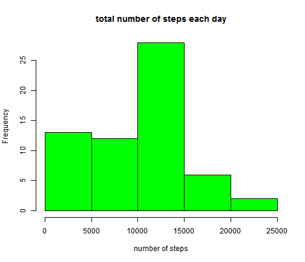
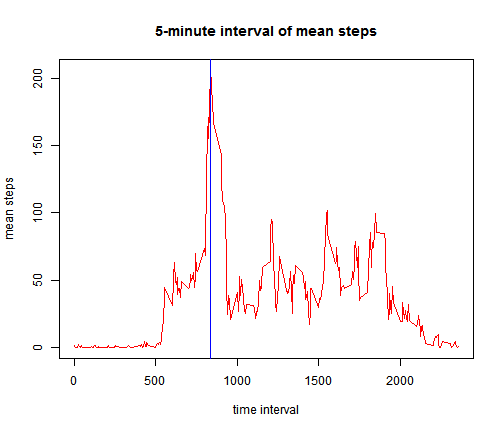
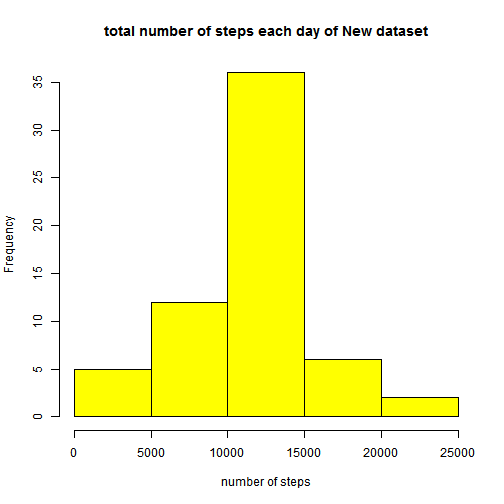
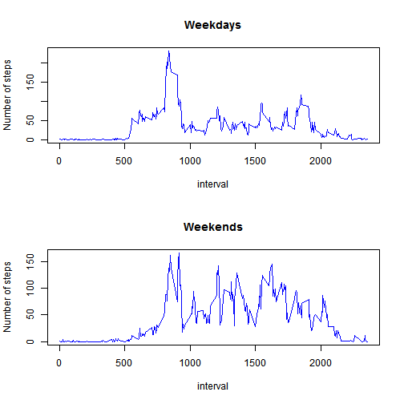

========================================================

# Load and process data


```r
data <- read.csv("activity.csv")
```

# What is mean total number of steps taken per day?
## --histogram, mean and median of steps every day

```r
agg <- aggregate(data$steps, by=list(Category=data$date), FUN=sum,na.rm=T)
hist(agg$x,col="green",xlab="number of steps", main="total number of steps each day")
```

 


```r
meanStep <- mean(agg$x)
medianStep <- median(agg$x)
cat("mean of steps is: ", meanStep, "; median of steps: ", medianStep)
```

```
## mean of steps is:  9354 ; median of steps:  10395
```

# What is the average daily activity pattern?
## 5-minute time-series plot on mean steps across each interval


```r
agg2 <- aggregate(data$steps, by=list(Category=data$interval), FUN=mean,na.rm=T)
plot(x=agg2[,1], y=agg2[,2], type="l", col="red", xlab="time interval", ylab="mean steps", main="5-minute interval of mean steps")
maxSteps <- agg2[agg2$x==max(agg2$x),]
abline(v=maxSteps[1,1], col="blue")
```

 

```r
maxSteps
```

```
##     Category     x
## 104      835 206.2
```

# Imputing missing values
Total number of missing values in the dataset

```r
na <- is.na(data[,1])
cat(sum(na))
```

```
## 2304
```

Replacing NA with respoding day's mean and create a new dataset

```r
#na1 <- data[which(is.na(data)),]
#value <- agg[as.character(agg[,1])==as.character(na1[,2])[1],]
dataNew <- data
for (i in 1:nrow(dataNew)){
        if (is.na(dataNew$steps[i])){
                dataNew$steps[i] = agg2[agg2$Category==dataNew$interval[i],2]                
        }
        }
```

Histogram, mean and median of the total steps each day of the new dataset

```r
agg3 <- aggregate(dataNew$steps, by=list(Category=dataNew$date), FUN=sum)
hist(agg3$x,col="yellow", xlab="number of steps",main="total number of steps each day of New dataset")
```

 


```r
meanStep1 <- mean(agg3$x)
medianStep1 <- median(agg3$x)
cat("mean of steps is: ", meanStep1, "; median of steps: ", medianStep1)
```

```
## mean of steps is:  10766 ; median of steps:  10766
```
As we can from these two histograms, imputing missing value result a larger mean, , more clear weight on intercal 1000-1500, and closer mean and median.
# Are there differences in activity patterns between weekdays and weekends?
Create a new datset with tow factors:weekdays and weekends, and plot them

```r
date <- weekdays(as.Date(dataNew$date))
for (i in 1:length(date)) {
        if (date[i]=="Saturday"){
                date[i] = "Weekends"
        }else if(date[i]=="Sunday"){
                date[i] = "Weekends"
        }else {date[i] = "Weekdays"}
}
dataWhole <- cbind(dataNew[,c(1,3)], date)
aggData <-aggregate(dataWhole$steps, list(date=dataWhole$date,interval=dataWhole$interval), FUN=mean)
weekday <- aggData[aggData$date=="Weekdays",]
weekend <- aggData[aggData$date=="Weekends",]
par(mfrow=c(2,1))
plot(x=weekday$interval, y=weekday$x, type="l",col='blue',main="Weekdays", xlab="interval",ylab="Number of steps")
plot(x=weekend$interval, y=weekend$x, type="l",col='blue',main="Weekends", xlab="interval",ylab="Number of steps")
```

 

As we can see from the plot panel, steps during weekdays is more volatile and most steps happend around interval 800, while steps during weekends is more stable acrocss most intervals, which is intuitive since weekends are weekends.
